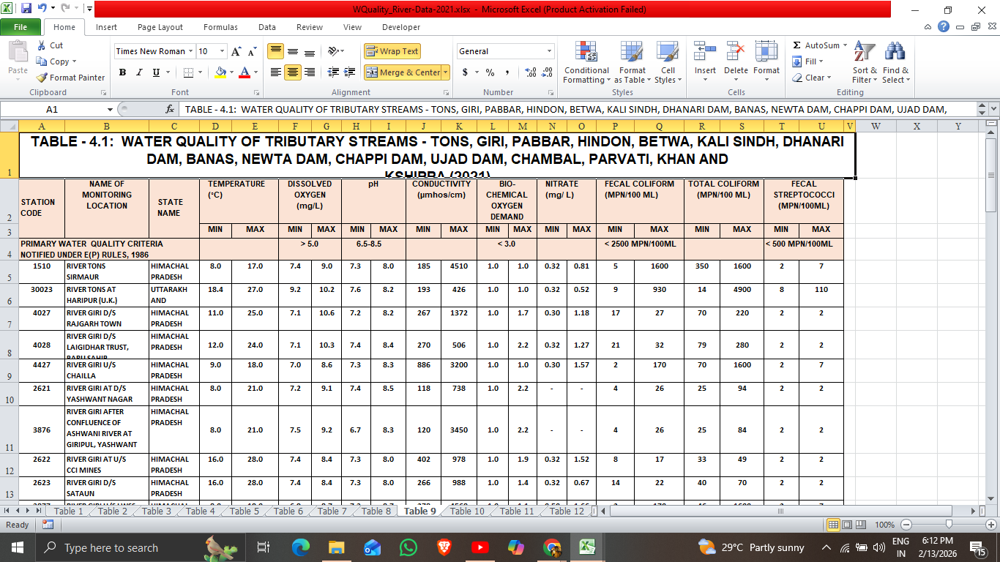
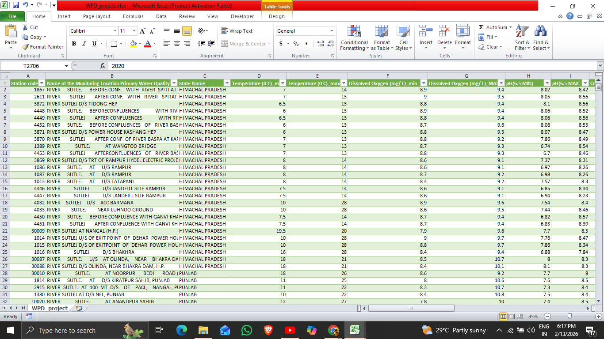
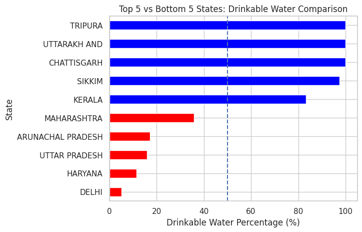
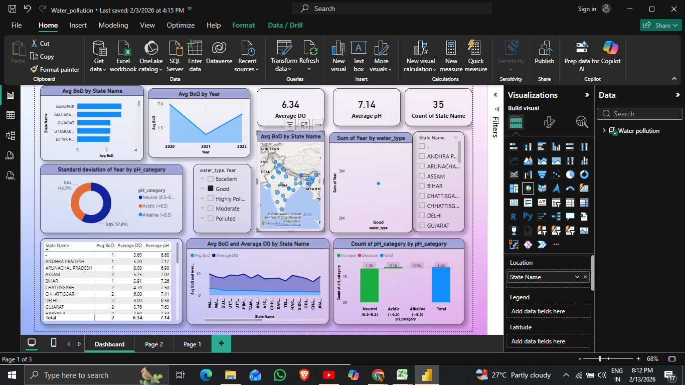

# 🌊 Water Pollution Analysis – India
### End-to-End Data Analysis & Visualization using Excel, Python, and Power BI

An end-to-end environmental data analytics project analyzing Indian water pollution data sourced from the Central Pollution Control Board (CPCB). This project demonstrates the complete workflow from raw government PDF data to an interactive business-ready dashboard.

---

## 📌 Project Overview

This project focuses on analyzing water pollution trends across Indian states using official CPCB data.  

The dataset was originally available in PDF format and was transformed into structured, analysis-ready data before performing exploratory analysis and dashboard development.

### 🔄 End-to-End Workflow
- 📥 Data extraction from government source (PDF)
- 📊 Data structuring and formatting in Excel
- 🧹 Data cleaning and transformation using Python
- 📈 Exploratory Data Analysis (EDA)
- 📊 Interactive dashboard development using Power BI

---

## 📂 Data Source

- **Organization:** Central Pollution Control Board (CPCB), Government of India  
- **Website:** https://cpcb.nic.in/nwmp-data/  
- **Original Format:** PDF  
- **Processed Format:** Structured Excel & CSV  

---

## 🧹 Data Cleaning & Preparation (Python)

**Libraries Used**
- pandas  
- numpy  
- matplotlib  
- seaborn  

**Key Cleaning Steps**
- Removed irrelevant and duplicate columns  
- Handled missing values  
- Standardized column names  
- Converted appropriate data types  
- Engineered derived features (`water_type`, `aquatic_score`, `pH_category`)  

---

## 📊 Exploratory Data Analysis (EDA)

- State-wise pollution comparison  
- BOD vs Dissolved Oxygen relationship analysis  
- Year-wise pollution trend evaluation  
- Water quality classification distribution  
- Correlation analysis between pollution indicators  

---

## 📊 Power BI Dashboard

The interactive Power BI dashboard provides:

- 🗺 State-wise pollution mapping  
- 📈 Year-wise pollution trend visualization  
- 📊 Top polluted states analysis  
- 💧 Water quality distribution  
- 🎛 Dynamic filtering by state and year  

---

## 📈 Key Insights

- Certain states consistently exhibit higher BOD levels.  
- Elevated BOD levels are associated with reduced Dissolved Oxygen.  
- Pollution levels vary significantly across years.  
- Water quality classification highlights regions requiring intervention.  

---

## 🛠 Tools & Technologies

- Microsoft Excel  
- Python (Pandas, NumPy, Matplotlib, Seaborn)  
- Jupyter Notebook  
- Power BI  
- Git & GitHub  

---

## 📁 Repository Structure

```
water-pollution-analysis-powerbi-python-excel/
├── data/
│ ├── raw/ # Original converted dataset
│ └── processed/ # Cleaned dataset used for analysis
├── excel/ # Structured Excel file
├── notebooks/ # Jupyter Notebook (EDA + cleaning)
├── powerbi/ # Power BI dashboard (.pbix)
├── images/ # Project screenshots
├── requirements.txt # Python dependencies
└── README.md
```

---


---

## 📊 Excel Data Structuring

### Raw Converted Data


### Structured and Cleaned Data


---

## 📊 Exploratory Data Analysis Visualizations

### Top 5 vs Bottom 5 States – Drinking Water Comparison


### Top 10 States by Aquatic Suitability Score


### Distribution of Water Quality Types


---

## 📊 Power BI Dashboard Preview



---

## 🚀 Project Highlights

- Complete pipeline from raw government PDF to interactive dashboard  
- Real-world environmental dataset  
- Demonstrates strong data cleaning, transformation, and visualization skills  
- Business-ready analytical dashboard  

---

## 📌 Future Enhancements

- Predictive modeling for pollution forecasting  
- Automated PDF data extraction pipeline  
- Deployment as a web-based analytical application  

---

## ⚠️ Disclaimer

This project is an independent analytical work. The dataset was sourced from the official CPCB website and processed, analyzed, and visualized for educational and portfolio purposes only.

---

## 📄 License

This project is licensed under the MIT License.

---

## 👨‍💻 Author

**Sateesh Kumar Patlegar**

📧 patlegarsateeshkumar@gmail.com  
🔗 LinkedIn: https://www.linkedin.com/in/patlegar-sateesh-kumar-868870258/  
💼 Open to Data Science, Analytics, and Quant opportunities
